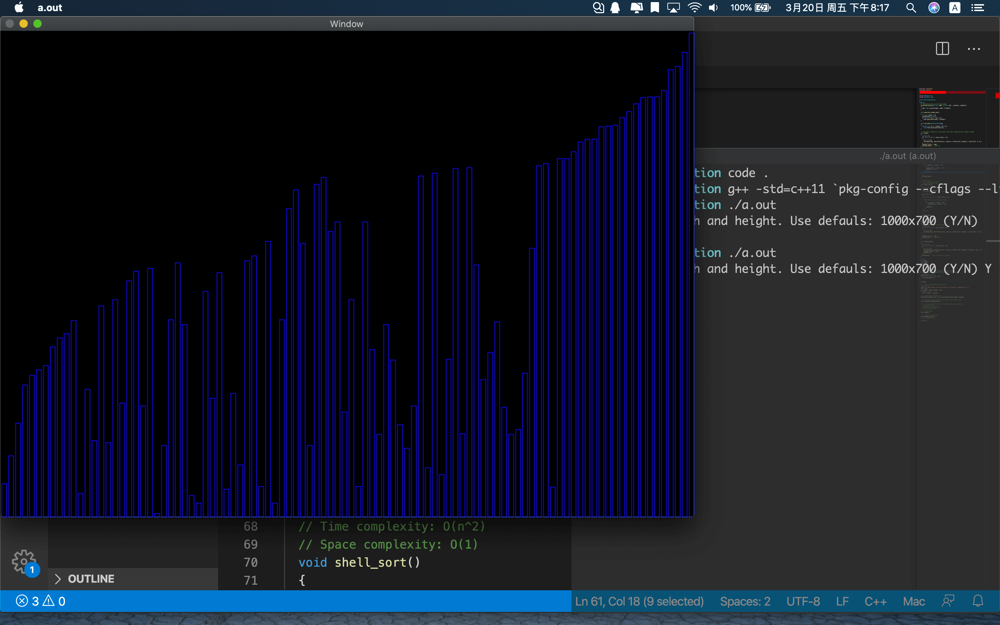
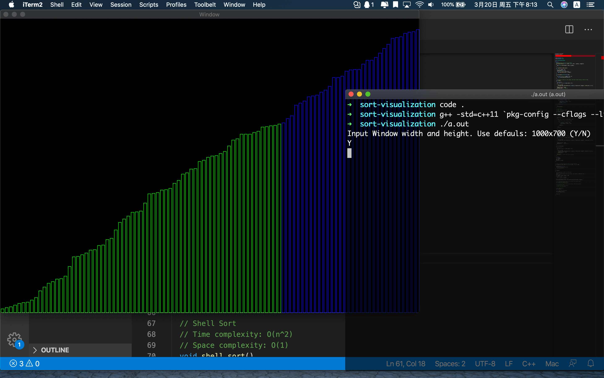
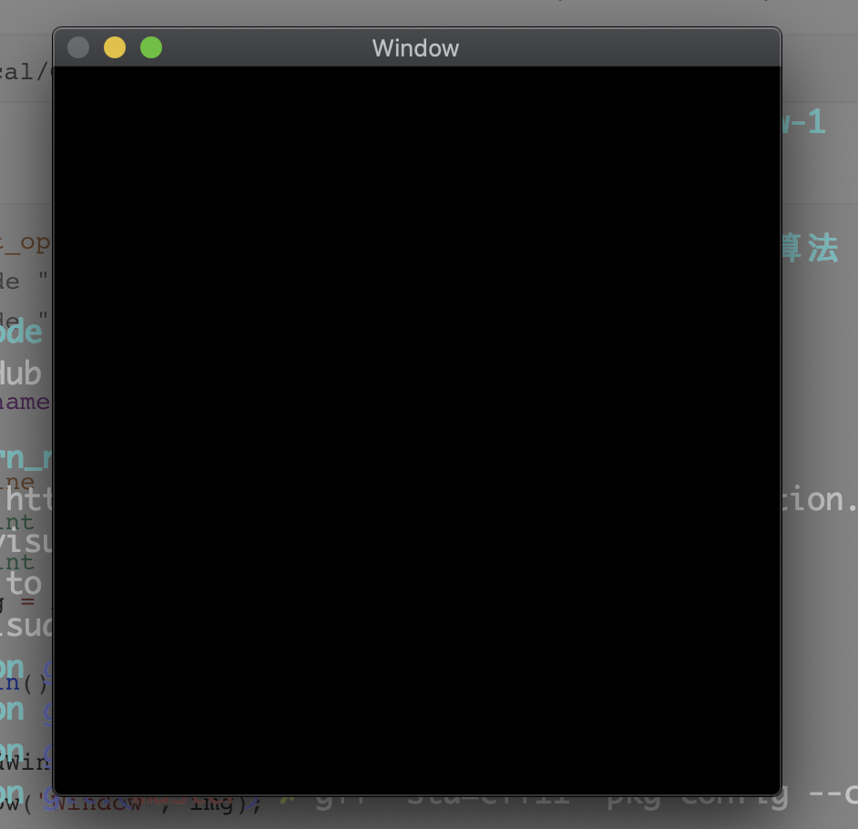

## 排序算法的可视化

[TOC]

### 背景

我学习了 [bobo 老师](https://github.com/liuyubobobo/Play-with-Algorithm-Visualization) 在 MOOC 上的课程，看得见的算法。bobo 老师使用的是 Java，我大学期间并没有系统的学过 Java（有一点 Android App 开发基础），所以我并没有跟着编程实践。最近在找工作准备面试和研究生复试，复习到了排序算法。

排序算法是算法领域十分重要的一项知识。所以我快速复习了常用十大排序算法，包括：

- 冒泡排序 Bubble Sort
- 选择排序 Selection Sort
- 插入排序 Insertion Sort
- 希尔排序 Shell Sort
- 快速排序（一路/双路/三路） Quick Sort
- 归并排序 Merge Sort
- 堆一排序 Heap Sort
- 计数排序 Counting Sort
- 基数排序 Radix Sort
- 桶子排序 Bucket Sort

并且实现算法的可视化，程序运行的截图如下：






## 运行环境

我使用的电脑是 macOS 10.15.2。具备 C++11 编译器，以及拥有 OpenCV 环境。OpenCV 在我电脑上位于：

```shell
/usr/local/Cellar/opencv/4.1.0_2/include/opencv4/opencv2
```

下面的程序可以用于验证编程环境：

```c++
// test_opencv.cc
#include "opencv2/highgui/highgui.hpp"
#include "opencv2/imgproc/imgproc.hpp"

using namespace cv;

// Define the window.
const int kHeight = 400;
const int kWidth = 400;
Mat img = Mat::zeros(kWidth, kHeight, CV_8UC3);

int main()
{
  namedWindow("Window", 1);
  imshow("Window", img);
  waitKey(0);
  return 0;
}

```


### 编译命令

```c++
# 编译
g++ -std=c++11 `pkg-config --cflags --libs opencv` test_opencv.cc

# 运行
./a.out
```


程序运行的结果是弹出一个黑框。




## 排序算法可视化

算法流程非常简单。定义窗口、生成数据、绘制数据和调用排序算法。

```c++

// 1. Initializes Window size.
SortVisualization* sort = new SortVisualization(width, height);

// 2.1 Initializes the data to be sorted. Use default data.
sort->generate_random_nums();

// 3. Show Window.
sort->show();

// 4. Test sort algorithm.
sort->bubble_sort();
// sort->shell_sort();
```


在排序算法中，每次数据位置发生变化时，只需要调用自定义的 `update` 函数即可。`update` 函数内部包含重绘、延时，是实现动态可视化的核心。

```c++
  // Bubble Sort
  // Time complexity: O(n^2)
  // Space complexity: O(1)
  void bubble_sort()
  {
    bool sorted = false;
    for (int i = 0; i < nums.size() && !sorted; ++i)
    {
      sorted = true;
      for (int j = 1; j < nums.size() - i; ++j)
      {
        if (nums[j] > nums[j - 1])
        {
          swap(nums[j], nums[j - 1]);
          sorted = false;
        }
        update();
      }
    }
    sorted_show();
  }

```


**` main.cc ` ，源码面前，了无秘密。**


Notes by Landon.

2020-03-20